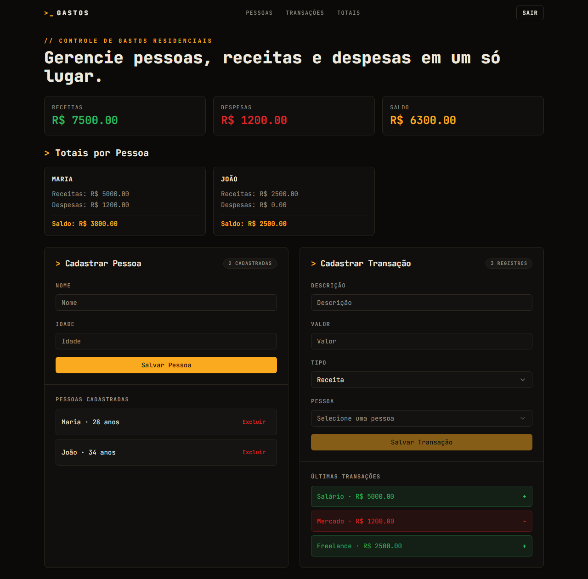

# 💰 Controle de Gastos Residenciais

Aplicação para gerenciar as finanças da casa: cadastre pessoas, registre receitas e despesas e acompanhe os totais por pessoa e o saldo geral.

- **Frontend:** React + TypeScript + Vite + Tailwind/shadcn
- **Backend:** API .NET 8 (Minimal APIs) com EF Core e autenticação JWT
- **Banco:** SQLite no desenvolvimento, PostgreSQL em produção



---

## 🚀 Começar em 2 passos

> **Você vai precisar de:** [Node.js](https://nodejs.org) + [pnpm](https://pnpm.io/installation) e o [.NET 8 SDK](https://dotnet.microsoft.com/download).

Na **raiz do projeto**, rode:

```bash
pnpm install
pnpm dev
```

Pronto. O comando `pnpm dev` cuida de tudo automaticamente:

1. sobe a API .NET em `http://localhost:5000`;
2. espera o health check (`/health`) responder;
3. inicia o frontend em `http://localhost:5173`.

Depois é só abrir 👉 **http://localhost:5173**

### Entrar no sistema (login de dev)

| Campo   | Valor   |
| ------- | ------- |
| Usuário | `admin` |
| Senha   | `admin` |

---

## 🐳 Alternativa: rodar com Docker

Se preferir não instalar o .NET e o Node localmente, use o Docker (sobe API + PostgreSQL):

```bash
docker compose up --build
```

- API disponível em `http://localhost:5000`.
- Em produção, defina `JWT_SECRET`, `AUTH_USERNAME` e `AUTH_PASSWORD` por variáveis de ambiente.

---

## ✨ O que dá para fazer

- Cadastrar e remover **pessoas** da casa.
- Registrar **transações** (`receita` ou `despesa`) associadas a uma pessoa.
- Ver **totais por pessoa** e o **resumo geral** (total de receitas, despesas e saldo).

### Endpoints da API

Todas as rotas (exceto o login) exigem o token JWT retornado por `POST /auth/login`.

| Método   | Rota                | Descrição                          |
| -------- | ------------------- | ---------------------------------- |
| `POST`   | `/auth/login`       | Autentica e devolve o token JWT    |
| `GET`    | `/pessoas`          | Lista as pessoas                   |
| `POST`   | `/pessoas`          | Cria uma pessoa                    |
| `DELETE` | `/pessoas/{id}`     | Remove uma pessoa                  |
| `GET`    | `/transacoes`       | Lista as transações                |
| `POST`   | `/transacoes`       | Cria uma transação                 |
| `GET`    | `/totais`           | Retorna os totais por pessoa/geral |

> Em ambiente de desenvolvimento, a documentação **Swagger** fica disponível em `http://localhost:5000/swagger`.

---

## 📁 Estrutura do projeto

```text
.
├── backend/    # API .NET 8 (camadas Api, Application, Domain, Infrastructure, Tests)
├── frontend/   # app React + TypeScript + Vite
├── docs/       # documentação de convenções e estrutura
└── .claude/    # regras e skills do assistente
```

O backend segue arquitetura em camadas:

```text
backend/
├── ControleGastos.Api/            # host HTTP, endpoints, middleware
├── ControleGastos.Application/    # serviços, DTOs, validações (FluentValidation)
├── ControleGastos.Domain/         # entidades e regras de domínio
├── ControleGastos.Infrastructure/ # EF Core, JWT, migrations
└── ControleGastos.Tests/          # testes de integração (xUnit)
```

---

## 🧪 Testes

**Frontend** (Vitest + Playwright), a partir de `frontend/`:

```bash
pnpm test          # testes unitários
pnpm test:e2e      # testes end-to-end (Playwright)
```

**Backend** (xUnit), a partir de `backend/`:

```bash
dotnet test ControleGastos.sln
```

---

## 🛠️ Rodar cada parte separadamente

Caso queira subir apenas um lado do projeto:

**Só a API:**

```bash
cd backend
dotnet run --project ControleGastos.Api
```

**Só o frontend** (o Vite faz proxy de `/api` para a porta 5000):

```bash
cd frontend
pnpm install
pnpm dev
```

---

## ❓ Problemas comuns

- **`pnpm` não encontrado:** instale com `npm install -g pnpm` ou veja o [guia oficial](https://pnpm.io/installation).
- **Frontend não sobe / fica esperando:** a API precisa responder em `http://localhost:5000/health`. Verifique se o .NET 8 SDK está instalado (`dotnet --version`).
- **Porta ocupada:** finalize o processo que usa a `5000` (API) ou a `5173` (frontend) e rode `pnpm dev` de novo.
```
